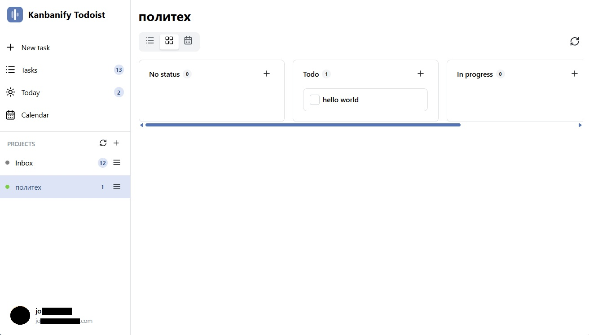

# Kanbanify Todoist

[](LICENSE) [](https://www.electronjs.org/) [](https://react.dev/) [](https://www.typescriptlang.org/) [](https://mantine.dev/) [](https://biomejs.dev/) [](#getting-started) [](#roadmap)

A desktop client for Todoist that adds a kanban workflow on top of your existing tasks — without a paid plan.



> This application is not created by, affiliated with, or supported by Doist. "Todoist" is a trademark of Doist Inc.


## Motivation

Todoist has no task status. A task is either open or done, so the intermediate state — *I started this, it is not finished yet* — has nowhere to live. Native statuses and boards exist only on paid plans, and the free API does not expose them at all.

Kanbanify solves this with what the free plan already gives you: **labels**. Three reserved labels (`todo`, `in-progress`, `completed`) become kanban columns, and dragging a card between columns just rewrites the label through the Todoist API. Your data stays in Todoist, stays portable, and stays readable in the official apps.

Two things worth knowing:

- The `completed` kanban status is **not** the same as a completed Todoist task. A card in the last column is still active until you check it off — two independent axes of state.
- The app uses **only** free-plan features. `deadline` and `duration` are Pro fields, so the regular `due` date plays the deadline role everywhere.


## Features

Implemented in the MVP:

- **Authorization** by personal Todoist Access Token — no OAuth. The token is encrypted with Electron `safeStorage` and never leaves the main process.
- **Tasks screen** with two view modes: a list and a 4-column kanban board with drag-and-drop status changes.
- **Today screen** — `today` and `overdue` tasks in separate sections, with bulk rescheduling of overdue ones.
- **Calendar screen** — an agenda list and a month grid with drag-to-reschedule.
- **Projects** — sidebar list, per-project pages (list, board and calendar modes), create, edit, archive, delete.
- **Task management** — create, edit, complete, delete, subtasks, priorities, due dates and labels.
- **Comments and attachments** — task comments with file upload and download.
- **Desktop integration** — system tray with minimize-to-tray, Windows installer build.

Optimistic updates everywhere: the UI reacts instantly and rolls back if the API call fails.


## Tech stack

| Layer | Choice |
|---|---|
| Platform | Electron + `electron-vite`, TypeScript |
| Main process | Clean Architecture, `@doist/todoist-sdk`, `safeStorage` |
| Bridge | Electron IPC through a typed preload contract |
| Renderer | React 19, React Router, Mantine UI, dnd-kit, TanStack Query, Day.js, Zod |
| Architecture (renderer) | Feature-Sliced Design |
| Tooling | Vitest + Testing Library, Biome, electron-builder |

The renderer never sees the access token and never talks to the Todoist API directly — every request goes through IPC. Reasoning behind these choices is recorded as ADRs in [`docs/decisions/`](docs/decisions/).


## Getting started

Requires Node.js 20+ and Yarn (via Corepack).

```bash
yarn install
yarn dev
```

On first launch the app asks for a Todoist API token: *Todoist → avatar → Settings → Integrations → Developer → Copy API token*.

| Command | Action |
|---|---|
| `yarn dev` | run the app in development mode |
| `yarn build` | production build |
| `yarn dist:win` | build a Windows installer |
| `yarn typecheck` | type-check both processes |
| `yarn test` | run Vitest |
| `yarn lint` / `yarn format` | Biome lint / format |


## Roadmap

Possible next steps, already described in the specification but out of the MVP scope:

- **Dashboard** — task counters, due-date breakdown, kanban board stats and progress dynamics
- **Search** across tasks with filters by project, label, priority and due date
- **Task duplication** and a card context menu
- **Manual card ordering** inside kanban columns (drag-and-drop `childOrder`)
- **Comments on projects**, not only on tasks
- **macOS and Linux builds** — the codebase is cross-platform, only the packaging targets are missing

Deliberately postponed work with its unblocking triggers is tracked in [`docs/DEFERRED.md`](docs/DEFERRED.md).


## Documentation

The documentation hub is [`docs/README.md`](docs/README.md) — start there. Instructions for Claude Code live in [`CLAUDE.md`](CLAUDE.md). Documentation is written in Russian.


## License

[MIT](LICENSE)
